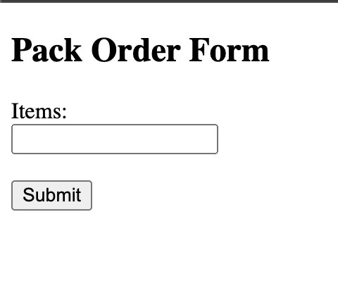
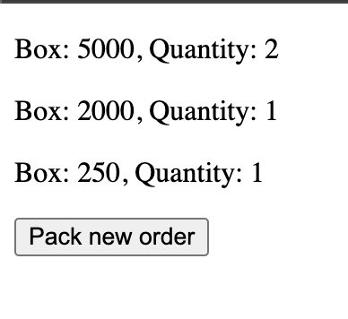

[](https://github.com/obalunenko/shipping-pack-optimizer/releases/latest)
[![Go [lint, test]](https://github.com/obalunenko/shipping-pack-optimizer/actions/workflows/go.yml/badge.svg)](https://github.com/obalunenko/shipping-pack-optimizer/actions/workflows/go.yml)
[](https://goreportcard.com/report/github.com/obalunenko/shipping-pack-optimizer)

# shipping-pack-optimizer Service

## Table of Contents

- [What is shipping-pack-optimizer?](#what-is-shipping-pack-optimizer)
- [How does shipping-pack-optimizer work?](#how-does-shipping-pack-optimizer-work)
  - [Frontend](#frontend)
  - [API](#api)
- [Configuration](#configuration)
- [Run the service](#run-the-service)
  - [Run with custom configs](#run-with-custom-configs)
- [Development](#development)
  - [Prerequisites](#prerequisites)
  - [Running the application](#running-the-application)
  - [Running tests](#running-tests)
  - [Linting](#linting)
  - [Code formatting](#code-formatting)
  - [Vendoring](#vendoring)

## What is shipping-pack-optimizer?

shipping-pack-optimizer is a Golang based application that calculates the number of packs needed to ship to a customer.

## How does shipping-pack-optimizer work?

### Frontend
The shipping-pack-optimizer service also provides a user-friendly frontend, from which the aforementioned API can be conveniently accessed and tested. 
You can reach the frontend from your browser at:

`http://localhost:8080`

The frontend itself is quite minimalistic - it contains an input field for submitting the number of items to be packed.



And upon submission, it presents neatly formatted API responses. 
The responses are conveniently displayed, showing each pack and the corresponding quantity.



### API

The application exposes its functionality through an HTTP API and accepts a JSON payload with the following structure:

```json
{
  "items": 501
}
```

The `items` field is a positive integer that represents the number of items that need to be packed.

The application responds with a JSON payload with the following structure:

```json
{
  "packs": [
    {
      "pack": 250,
      "quantity": 2
    },
    {
      "pack": 1,
      "quantity": 1
    }
  ]
}
```

It primarily runs on `localhost` port `8080` and acts upon `POST` requests to the `api/v1/pack` endpoint.

Below is a Curl command snippet demonstrating how to call this endpoint

```bash
curl --location --request POST 'localhost:8080/api/v1/pack' \
--header 'Content-Type: application/json' \
--data '{
    "items": 501
}'
```

## Configuration

Application follows the [12-factor app](https://12factor.net/) methodology and can be configured using environment variables.

Following environment variables are supported:

| Name         | Description                                                          | Default value            |
|--------------|----------------------------------------------------------------------|--------------------------|
| `PORT`       | The port on which the application will listen for incoming requests. | `8080`                   |
| `HOST`       | The host on which the application will listen for incoming requests. | `0.0.0.0`                |
| `LOG_LEVEL`  | The log level of the application.                                    | `info`                   |
| `LOG_FORMAT` | The log format of the application.                                   | `text`                   |
| `PACK_BOXES` | The pack boxes for packing orders. Values should be separated by `,` | `250,500,1000,2000,5000` |

## Run the service

All available docker image versions can be found here: https://github.com/obalunenko/shipping-pack-optimizer/pkgs
